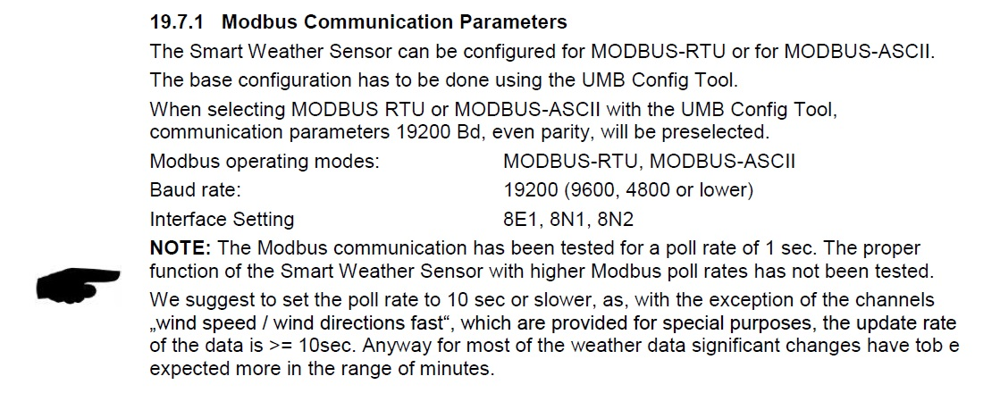
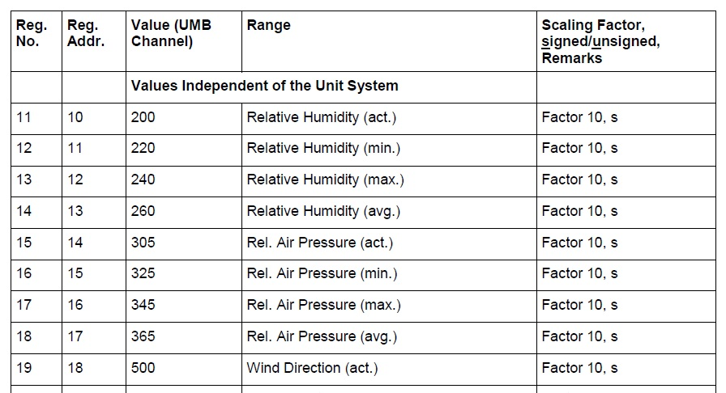

How to Use
##########

#. Obtain manufacturer documentation for your Modbus device indicating :ref:`register definitions <modbus-register-definitions>`.
#. Determine whether the device will be using RS-232 or RS-485 communication, and the settings for ``baudRate`` that will be used.
#. Determine which register data **parameters** are relevant for your application requirements, and how those are presented.
#. Decide which register data are to be captured in periodic **reports**, and at what *interval* that set of data is most useful.
#. Decide which register data are *time-critical* and need to be captured in real-time with an **alert**.
#. Create and save your ``config.dat`` **config file** using a text editor based on the :ref:`template <config-file-template>`.
#. Create your build package using :ref:`Solution Studio <solution-studio-package>`.

Example Use
***********

Create Your Configuration File
==============================

In this example we will be reading data from a weather station.

Manufacturer documentation: `Lufft Compact Weather Sensor WS504 <https://www.lufft.com/products/compact-weather-sensors-293/ws504-umb-smart-weather-sensor-1836/>`_

The WS504 requires some manual configuration to use RS-485 in Modbus mode, using 9600-8-N-1 serial.  The default Modbus Slave address is 1, which will be our ``networkId=1``.

.. _modbus-port:

	
	Lufft Weather Station Modbus Communications

We are only connecting to one device, so we will set ``deviceId=1``.

We find the registers of interest, which are all read-only values (``registerType=analog``) and all 16-bit signed integers (``encoding=int16``).
The manufacturer document provides both the PLC base-1 address (*register number*) and the native *register address*, so we can use the latter as ``address`` and 
leave the default configuration ``plcBaseAddress=0``.

.. _modbus-register-definitions:

	Lufft Weather Station Modbus Registers Example

And we map them to **parameters** using ``paramId``, ``registerType``, ``address`` and ``encoding``:

.. _config-file-template:

.. csv-table:: Configuration File Template
	:file: csvtables/config-file-template.csv
	:header-rows: 1

We want to send:

* All our parameters as a **report** (``reportingId=1``) every hour (``interval=3600``)
* Also send an immediate **alert** (``alertId=1``) if the temperature (``paramId=1``) goes above 35 degrees Celsius and another alert when temperature returns below 30 Celsius.
  The manufacturer document tells us the Modbus register contains temperature in degrees Celsius with a *factor 10*, so our thresholds will be ``highON=350`` and ``highOFF=300``

In order to get real-time temperature alerts, we will set ``pollInterval=10`` seconds.

.. _example-config-dat:

Our resulting ``config.dat`` file looks like::

	/* Example Modbus Proxy configuration for Lufft WS504 */
	/* PORTS */
	port=rs485;baudRate=9600;parity=none;mode=rtu
	/* DEVICES */
	deviceId=1;networkId=1;port=rs485;pollInterval=10;byteOrder=msb;wordOrder=msw;serialRxTimeout=1000;serialTxTimeout=1000;plcBaseAddress=0;retries=3
	/* PARAMETERS */
	/* Temperature in read-only register 32 */
	paramId=1;deviceId=1;registerType=analog;address=31;encoding=int16
	/* Humidity in read-only register 11 */
	paramId=2;deviceId=1;registerType=analog;address=10;encoding=int16
	/* Air Pressure in read-only register 15 */
	paramId=3;deviceId=1;registerType=analog;address=14;encoding=int16
	/* Wind speed in read-only register 87 */
	paramId=4;deviceId=1;registerType=analog;address=86;encoding=int16
	/* Wind direction in read-only register 19 */
	paramId=5;deviceId=1;registerType=analog;address=18;encoding=int16
	/* REPORTS */
	reportingId=1;interval=3600;paramIds=1,2,3,4,5
	/* ALERTS */
	alertId=1;paramId=1;maxON=350;maxOFF=300;paramIds=1,2,3,4,5

.. _solution-studio-package:

Create Your Build Package
=========================

.. note::
	Use of the tools described below requires that you have a PC with a modern version of Windows OS.

#. Download the latest **Modbus Proxy** package file from *TBD* or contact your *Inmarsat Representative*.  Make sure you select the correct build for **IDP** or **ST** terminals.
#. Download the latest terminal firmware package for your **terminal model** from `ORBCOMM <http://support.skywave.com/Support_AllDownload.aspx>`_ or contact your *Inmarsat Representative*.
#. Download and install the latest **Developer Toolkit** from ORBCOMM or contact your *Inmarsat Representative*.
#. Open **Solution Studio** from the **Developer Toolkit**
	
	#. Select :guilabel:`Add`, browse to the firmware package file and add it.
	#. Select :guilabel:`Add`, browse to the Modbus Proxy package file and add it.
	#. Select ``Modbus`` in the *Services* pane, then click :guilabel:`Properties`

	.. _changeDefaultMsgBitmap:

	#. Select :guilabel:`Add` then select ``004 - defaultMsgBitMap`` and set the value to ``04`` to enable ``timestamp`` on **reports** and **alerts**
	#. Return to the main GUI window by clicking :guilabel:`OK` when prompted.
	#. Click :guilabel:`Edit`, then click :guilabel:`Add` and browse to your ``config.dat`` file.  Click :guilabel:`OK` until you return to the main window.
	#. Select :menuselection:`Edit --> Core Service Properties` then set the following similar to ``defaultMsgBitMap`` above:

		* :menuselection:`Service --> 016-system` --> ``001 - executionWatchdogTimeout`` ==> ``30000``
		* :menuselection:`Service --> 016-system` --> ``003 - autoGCMemThreshold`` ==> ``5``
		* :menuselection:`Service --> 023-log` --> ``031 - traceSuppress3`` ==> ``1B 14``

	#. Click :guilabel:`OK` until you return to the main window.
	#. Select :menuselection:`Edit --> Post-Load Commands` and type the following, depending on your terminal model:

		.. table:: Post-load Commands (when using RS485 for Modbus)

			+--------------------------+-------------------------+
			|    **IDP series**        |    **ST series**        |
			+--------------------------+-------------------------+
			| | ``trace channel main`` | | ``log channel main``  |
			| | ``trace baud 9600``    | | ``log baud 9600``     |
			| | ``trace enable``       | | ``log serial enable`` |
			+--------------------------+-------------------------+

	#. Select :menuselection:`File --> Export Package` and save the resulting build file e.g. ``my_modbus.idppkg``.
	#. Select :menuselection:`File --> Export Message Definitions` and save the resulting ``my_modbus.idpmsg`` file.
	#. Save your Solution Studio file e.g. ``my_modbus.idpsln``.

	.. tip::
		Best practice would be to use a file naming convention that includes a version and/or date.

Install Your Package
====================

#. Connect to your terminal's main serial port using **Console** from the **Developer Toolkit**.  Ensure your terminal is powered up.
#. Select :menuselection:`File --> Open --> Open Connection` then select your **COM** port and Baud rate (default 9600).  Click :guilabel:`OK`.
#. Confirm that you see a ``shell>``, ``#``, or ``boot#`` prompt.

	.. tip::
		You may need to power cycle the terminal to get the ``boot loader`` message, then send 2 *break* (``CTRL-B``) commands within 5 seconds to get the ``boot#`` prompt.

#. Drag and drop your **build package** onto the black area of the screen.  Confirm that you see it begin the load process.

	* If prompted to *Format the flash file system*, select :guilabel:`OK`.

	.. figure:: figures/terminal-formatflash.jpg
		:scale: 100 %
		:alt: Format the flash file system

		Format the flash file system

	* Wait for the progress bar to complete.

	.. figure:: figures/terminal-packageload.jpg
		:scale: 75 %
		:alt: Loading the package using Console

		Loading the package file using Console

	* If you see the ``#`` prompt, enter the command ``start``.

#. If you are running Modbus on the main rs232, you will see a ``detaching shell`` message, then strange characters.

	.. tip::
		You can set up trace/log output on a spare serial port of the terminal.  For example, use rs232 for trace when rs485 is connected to your Modbus device.

#. Connect the configured serial port to your Modbus device.

Create Message Definition File
==============================

#. Contact your *Inmarsat Representative* to send your **idpmsg** file to have merged with default message definitions.

Uplode Message Definition File to Inmarsat Message Gateway
==========================================================

#. Your service provider can upload/associate the **message definition file** to your IsatData Pro **mailbox** and provide your authorization credentials for **OTA API** use.

Retrieve Data Using the IsatData Pro Messaging API
==================================================

#. Visit `Inmarsat Developer Portal <https://developer.inmarsat.com>`_

